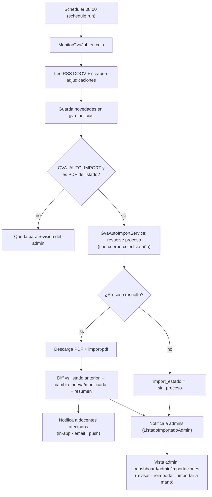

# Referencia de la API — VacanteDocente

Base URL: `/api/v1`. El OAuth social vive fuera de este prefijo, en rutas web
(`/auth/{provider}`), porque Socialite necesita redirigir el navegador.

## Autenticación

La API es **stateless** con tokens **Sanctum** (Bearer). Hay dos orígenes de token:

- **Email/contraseña** → el token viene en el cuerpo JSON de `register`/`login`.
- **OAuth** → el token llega al SPA como `/dashboard?token=…` tras el callback.

El SPA lo guarda en `localStorage` y lo envía en cada petición protegida:

```
Authorization: Bearer <token>
Accept: application/json
```

Las rutas **anónimas** (explorador sin cuenta) identifican al usuario con un
`session_token` autogenerado (cabecera `X-Session-Token` o campo `session_token`).

### Convenciones

- Errores de validación → **422** con `{ "message": "...", "errors": { campo: [..] } }`.
- No autenticado → **401**. Sin permiso (p. ej. admin) → **403**.
- Rate limit superado → **429**.

---

## 1. Auth

### `GET /auth/providers`
Métodos de acceso disponibles (para pintar los botones).
```json
{ "password": true, "providers": ["google", "microsoft"] }
```

### `POST /auth/register`  · público · `throttle:10,1`
```json
// request
{ "name": "Ana Pérez", "email": "ana@example.com",
  "password": "secreta123", "password_confirmation": "secreta123" }
// 201
{ "token": "12|abc...", "user": { "id": 5, "email": "ana@example.com", "name": "Ana Pérez" } }
```

### `POST /auth/login`  · público · `throttle:10,1`
```json
// request
{ "email": "ana@example.com", "password": "secreta123" }
// 200
{ "token": "13|def...", "user": { "id": 5, "email": "ana@example.com" } }
// 422 si las credenciales no son correctas
{ "message": "...", "errors": { "email": ["Las credenciales no son correctas."] } }
```

### OAuth (rutas web)
- `GET /auth/google` · `GET /auth/microsoft` → redirige al proveedor.
- `GET|POST /auth/{provider}/callback` → crea/actualiza usuario y redirige a
  `/dashboard?token=…`. Errores → `/?error=oauth[...]`.
- `POST /auth/logout` (Bearer) → revoca el token actual.

---

## 2. Catálogo (público)

### `GET /specialties`
Especialidades agrupadas por nivel: `{ "maestros": [...], "secundaria": [...], "fp": [...] }`.

### `GET /colectivos`
`{ "data": [ { "id", "code", "name", "body" } ] }`.

### `GET /procesos`
```json
{ "data": [ {
  "id": 5, "nombre": "Interins Secundària 2026-2027", "anyo": 2026,
  "curso": "2026-2027", "estado": "publicado", "colectivo": { "code": "INTERINO", "body": "SECUNDARIA" },
  "vacancies_count": 9588, "fecha_fin_peticiones": "2026-07-10"
} ] }
```

### `GET /procesos/{proceso}/vacantes`
Filtros (query): `especialidad`, `provincia`, `localitat`, `tipo_centro[]`,
`tags[]`, `observaciones`, `req_ling`, `itinerante`, `per_page`, `session_token`.
```json
{ "data": [ {
  "id": 101, "num": 9688, "provincia": "Alacant", "localidad": "ALTEA",
  "centro_codigo": "03010880", "centro_nombre": "CEIP EL BLANQUINAL",
  "tipo_centro": "Primaria/Infantil", "req_ling": false, "itinerante": false,
  "observ_tags": ["CRA", "CEE"], "cambio": "nueva",
  "distances": { "driving_ida": { "duration_minutes": 22, "distance_km": 18.4 } }
} ], "meta": { "current_page": 1, "last_page": 1, "total": 120 } }
```
`cambio`: `"nueva" | "modificada" | null`.

### `GET /procesos/{proceso}/cambios`
Resumen del último import (banner «listado actualizado»).
```json
{ "has_changes": true, "importado_en": "2026-06-22T08:00:00+00:00",
  "nuevas": 3, "modificadas": 2, "eliminadas": 1 }
```

### `GET /participantes/{proceso}`  · query `nombre`
Lista paginada de participantes (incluye `cambio`, `posicion`, `estado`).

### `GET /participantes/{proceso}/cambios`
`{ "has_changes": true, "importado_en": "...", "nuevos": 2, "modificados": 1, "eliminados": 0 }`.

### `GET /centros` · `GET /centros/{codigo}`
Directorio de centros (filtros `provincia`, `caracteristica`, `localidad`, `q`, `page`).

### `GET /gva/noticias`
Últimas novedades oficiales detectadas por el monitor.

### `GET /geocode?q=...`  · `throttle:geocode`
Autocompletado de direcciones (Places → fallback Geocoding).

---

## 3. Listas anónimas (`session_token`)

| Método | Ruta | Nota |
|---|---|---|
| POST | `/user-lists` | crea/recupera lista de `session_token + specialty_id` |
| PATCH | `/user-lists/{id}` | domicilio (`home_address`, `home_lat`, `home_lng`) |
| GET | `/user-lists/{id}/preferences` | preferencias ordenadas |
| PUT | `/user-lists/{id}/preferences/bulk` | upsert masivo (transacción) |
| POST | `/user-lists/{id}/geocode` | `throttle:geocode` |
| POST | `/user-lists/{id}/calculate-distances` | `throttle:distances` |

El binding de `{userList}` está protegido (IDOR): exige el `session_token` dueño
de la lista (cabecera `X-Session-Token` o campo), o responde **403**.

```jsonc
// PUT /user-lists/{id}/preferences/bulk
{ "preferences": [
  { "vacancy_id": 101, "status": "selected", "position": 1, "notes": null },
  { "vacancy_id": 102, "status": "revisar",  "position": 0 }
] }
```
`status`: `selected | revisar | neutral | discarded`.

```jsonc
// POST /user-lists/{id}/calculate-distances
{ "session_token": "…", "mode": "all" }   // driving | transit | walking | all
```

---

## 4. Push web

### `GET /push/vapid-key`  · público
`{ "enabled": true, "public_key": "B...." }`.

### `POST /push/subscribe`  · Bearer
```json
{ "endpoint": "https://push…/abc",
  "keys": { "p256dh": "…", "auth": "…" },
  "contentEncoding": "aes128gcm" }
// → { "subscribed": true }
```

### `POST /push/unsubscribe`  · Bearer
`{ "endpoint": "https://push…/abc" }` → `{ "subscribed": false }`.

---

## 5. Notificaciones (Bearer)

### `GET /notificaciones`
```json
{ "data": [ {
  "id": "uuid", "read_at": null, "created_at": "2026-06-22T08:00:00+00:00",
  "data": { "tipo": "vacantes", "titulo": "Listado actualizado — …",
            "descripcion": "Cambios: 3 nuevas · 2 modificadas",
            "resumen": { "nuevas": 3, "modificadas": 2, "eliminadas": 1 } }
} ], "unread": 1 }
```

### `POST /notificaciones/leer/{id?}`
Marca una (con `id`) o **todas** (sin `id`) como leídas → `{ "unread": 0 }`.

---

## 6. Perfil y cuenta (Bearer)

| Método | Ruta | Nota |
|---|---|---|
| GET | `/user/me` | usuario + relaciones (incluye `is_admin`) |
| GET / PUT | `/user/profile` | perfil completo / actualizar (geocodifica domicilio) |
| POST | `/user/especialidades` | alta/actualización de bolsa |
| DELETE | `/user/especialidades/{specialty}` | baja |
| GET | `/user/dashboard` | agregados del panel (incluye `proceso_listado`) |
| GET / PUT | `/user/lista` · `/user/lista/sync` | lista priorizada sincronizada a la cuenta |
| GET | `/participantes/{proceso}/mi-posicion` | posición sobre el último listado |

```json
// GET /participantes/{proceso}/mi-posicion
{ "found": true, "posicion": 7, "estado": "Activat", "cambio": "modificado",
  "especialidad_codigo": "206", "listado_fecha": "2026-06-22",
  "adjudicacion": null }
// 422 si falta el nombre GVA en el perfil
```

```json
// PUT /user/profile (campos opcionales)
{ "nombre_gva": "PEREZ GOMEZ, ANA", "direccion_origen": "C/ …",
  "lat_origen": 39.47, "lng_origen": -0.37, "locale": "es",
  "notificaciones_email": true, "colectivo_id": 3 }
```

---

## 7. Tablón de anuncios (Bearer salvo el listado)

`GET /tablon` (público) · `GET /tablon/mis-anuncios` · `POST /tablon` ·
`DELETE /tablon/{anuncio}` · `POST /tablon/{anuncio}/contactar` ·
`GET /tablon/{anuncio}/contactos` · `POST /tablon/contactos/{contacto}/responder`.

---

## 8. Administración (Bearer · `is_admin` o id 1)

| Método | Ruta | Nota |
|---|---|---|
| GET | `/admin/gva-noticias` | novedades sin notificar |
| GET | `/admin/gva-importaciones` | listados PDF detectados + estado de import |
| POST | `/admin/gva-importaciones/{noticia}/reimportar` | reimporta (opcional `proceso_id` + `kind`) |

```json
// POST /admin/gva-importaciones/{id}/reimportar
{ "proceso_id": 5, "kind": "participantes" }   // ambos opcionales
// → { "resumen": "Participantes (…): 320 en lista · 4 nuevos…",
//      "import_estado": "ok", "importado_en": "…", "proceso": { "id": 5, "nombre": "…" } }
```
`import_estado`: `ok | sin_proceso | error`.

---

## Flujo del monitor GVA



**Requisitos para que el flujo corra**: cron `schedule:run`, un worker
`queue:work` activo y `pdftotext` instalado (ver `DEPLOYMENT.md` §7–8).
